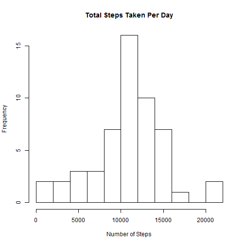
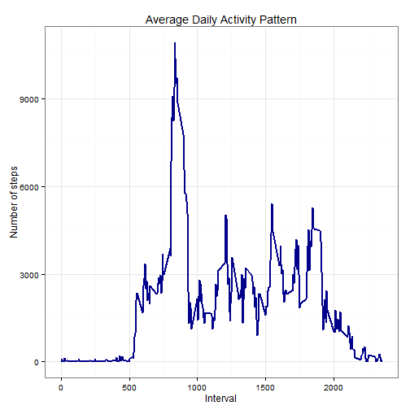
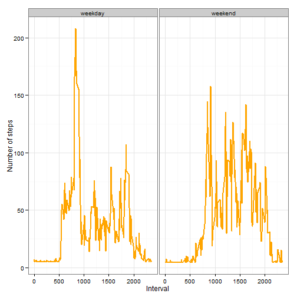

##Loading and preprocessing the data  


```r
steps <- read.csv("activity.csv")     ##load data

steps$date <- as.Date(steps$date)     ##change date column class

clean_steps <- na.omit(steps)         ##remove NA/Missing Value rows
row.names(clean_steps) <- NULL 

daily_steps <- aggregate(steps ~ date, data = clean_steps, sum)

hist(daily_steps$steps, main="Total Steps Taken Per Day", breaks=10, xlab="Number of Steps")
```

 

##What is mean total number of steps taken per day?


```r
mean_steps = round(mean(daily_steps$steps), 2)
median_steps = round(median(daily_steps$steps), 2)
options(scipen=999)
```

###The mean number of steps taken per day is: 10766.19   
###The median number of steps taken per day is: 10765

##What is the average daily activity pattern?


```r
interval_steps <- aggregate(steps ~ interval, data = clean_steps, sum)

library(ggplot2)
ggplot(interval_steps, aes(x=interval, y=steps)) +   
    geom_line(color="darkblue", size=1) +  
    labs(title="Average Daily Activity Pattern", x="Interval", y="Number of steps") +  
    theme_bw() + theme(legend.position = "bottom")
```

 

```r
max_step_interval <- interval_steps[which.max(interval_steps$steps),]$interval
```

###The invertal with the maximum number of total steps is: 835

##Imputing missing values


```r
NAs <- sum(is.na(steps$steps))
```

###In the original dataset there are 2304 rows with NA values (missing values) for the number of steps.

My method here was to simply take the mean of the steps column - without NA values - and replace the NAs with that number. 


```r
library(emil) #package includes an na.fill function

filled_steps <- na.fill(steps, mean(clean_steps$steps))
filled_daily_steps <- aggregate(steps ~ date, data = filled_steps, sum)

hist(filled_daily_steps$steps, main="Total Steps Taken Per Day - with imputed NA", breaks=10, xlab="Number of Steps")
```

 

```r
filled_mean_steps = round(mean(filled_daily_steps$steps), 2)
filled_median_steps = round(median(filled_daily_steps$steps), 2)
options(scipen=999)
```

###The mean number of steps taken per day is: 10766.19   
###The median number of steps taken per day is: 10765

Do these values differ from the estimates from the first part of the assignment? No. Not at all.

What is the impact of imputing missing data on the estimates of the total daily number of steps? There were 9 extra rows in the aggregated data but otherwise it's the same. 

##Are there differences in activity patterns between weekdays and weekends?


```r
filled_steps$weekday <- weekdays(filled_steps$date)

weekday_type <- ifelse(filled_steps$weekday %in% c("Saturday","Sunday"),"weekend", "weekday")

weekday_type <- as.factor(weekday_type)

filled_steps$weekday.type <- weekday_type

filled_steps_average <- aggregate(filled_steps$steps,list(interval = as.numeric(as.character(filled_steps$interval)), weekdays = filled_steps$weekday.type), FUN = "mean")

colnames(filled_steps_average)[3] <- "steps"

ggplot(filled_steps_average, aes(x=interval, y=steps)) + 
    geom_line(color="orange", size=1) + 
    facet_wrap(~ weekdays) +
    labs(x="Interval", y="Number of steps") +
    theme_bw()
```

 

There are differences between weekdays and weekends. It appears that people get started later in the day on the weekends but over all stay more active during the day. The weekdays have a spike in the morning but dips during the day. 
